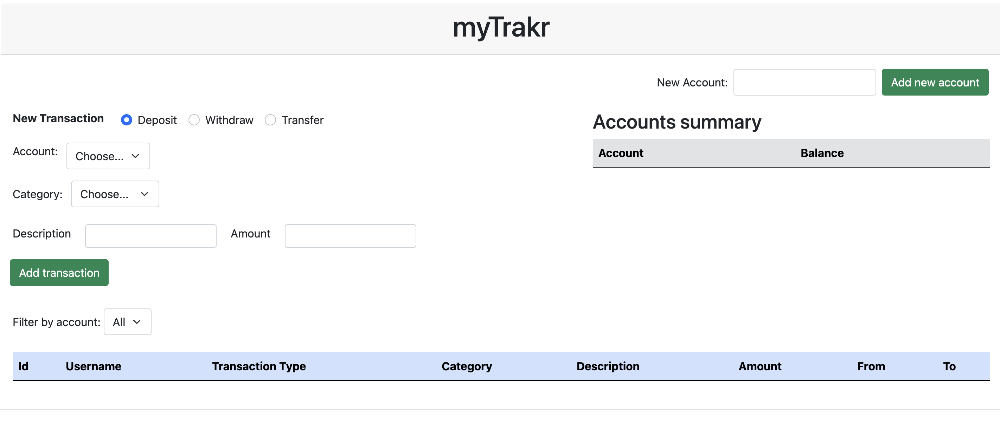

# MyTrack Project

MyTrack is a single page application that can track all your accounts and transactions.

User should be able to create multiple accounts, set transactions like deposits, withdraws and transfer between accounts.

All the data should be entered manually, but since it's posted, records will be kept in the server.

> This project has educational purpose only. Real personal data should not be entered for the sake of privacy.

With all that said, let's code! 💻 🚀

## Screenshot

This design is just a reference, it doesn't mean that your project should looks like the same.



## Setup for Backend

1. change directory to `/backend`

```zsh
  cd backend
```

2. install dependencies

```zsh
  npm i
```

3. run express server

```zsh
  npm run dev
```

> For this project, you are not required to work on backend, but please feel free to browse (You can update if you would like to 😎). Please ask for help if anything goes wrong or if the server is not working as expected.

## API Endpoints

All the requests should have the domain of `http://localhost:3000`.

- GET `/accounts`: get all the accounts
- POST `/accounts`: saves a new account

  expects:

  ```js
  {
    // would be used as username
    newAccount: "some username";
  }
  ```

- GET `/transactions`: get all the transactions from all accounts
- POST `/transactions`: saves a new transaction

  expects:

  ```js
  {
    newTransaction: {
      // account ID for Deposits or Withdraws
      accountId: 0,

      // sender ID if type = 'Transfer', otherwise null
      accountIdFrom: 0,

      // receiver ID if type = 'Transfer', otherwise null,
      accountIdTo: 1

      // 'Deposit', 'Withdraw', or 'Transfer'
      type: "Deposit",

      // amount of the transaction
      amount: 100,

      // category ID
      categoryId: 0,

      // description of the transaction
      description: "My first income in 2024",
    }
  }
  ```

- GET `/categories`: get all the categories
- POST `/categories`: saves a new category

  expects:

  ```js
  {
    newCategory: "some category",
  }
  ```

## Requirements

### Team setup

Please reference the [Project Planning](https://docs.google.com/presentation/d/19tddWSkYeJKEA6HKOyjY56RKcrKSQH0NdSL3Mu5KuV8/edit?usp=sharing)

- [ ] Be ready for an interview in the project week
- [ ] Proper Project planning must be done
- [ ] Use Github Project for your project management
- [ ] Make sure to write user stories and those must used while creating tickets
- [ ] Do stand-ups

### Features

Users should be able to view and generate

- [ ] Accounts
- [ ] Categories
- [ ] Transactions: Deposit, Withdraw, Transfer

### Tools

Any tools you have learned so far can be used and optionally you can use `Astro` if you like to!! However, you MUST use jquery in the project

### How to split the project (in case of team mates)

> This is just a recommendation!

- Member 1 (Hard):
  - New Transaction section
- Member 2 (Moderate):
  - New Account section
  - Account Summary
- Member 3 (Easy):
  - Transactions list
  - Filter by account, category, transaction type (bonus)
- Bonus:
  - Notification animation when a new transaction or account is created

## Please keep in mind!!

- if something fails in your team, it is not one of your team member's failure but `WHOLE TEAM`.
- if you do not want to lead, `follow` the lead
- Decide as a team
- Be responsive - no longer than half day
- Please flag if you think you are behind
- If you stuck on a problem more than 1 hour, It is time to ask for help
- Take an action instead of keep thinking
